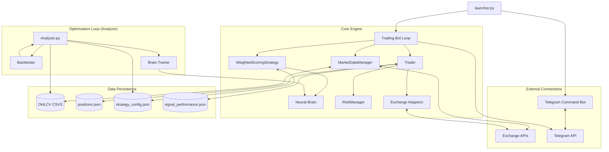

# Trading Bot Knowledge Base & System Flows

This document serves as the authoritative technical reference for the Trading Bot's architecture, logic flows, and operational procedures.

## 🏗 System Architecture

The bot is designed with a modular architecture to support multiple exchanges, complex strategy signals, and robust risk management.

---

## 🏎 Core Logic Flows

### 1. Market Data & Signal Flow
The bot operates on a "Heartbeat" cycle. Each cycle follows this data-to-signal pipeline:

1.  **Ingestion**: `MarketDataManager` fetches latest candles (OHLCV) from all `ACTIVE_EXCHANGES`.
2.  **Validation**: Candles are checked for integrity (NaNs, missing bars).
3.  **Feature Engineering**: Raw candles are transformed into 17+ technical indicators (RSI, EMA, MACD, etc.).
4.  **Scoring**: `WeightedScoringStrategy` applies weights from `strategy_config.json` to calculate a heuristic score.
5.  **Validation**: `NeuralBrain` (RL-MLP) performs a Veto (score < 0.3) or Boost (score > 0.8) on the signal.
6.  **Sizing**: If `score >= threshold`, `RiskManager` determines position size based on balance and target leverage.

### 2. Order Execution & Protection Flow
When a signal is approved:

1.  **Preparation**: `Trader` checks for existing positions and reserves balance.
2.  **Placement**: A `Limit` or `Market` order is sent to the specific **Exchange Adapter**.
3.  **Monitoring**:
    *   **Market**: Immediate fill, then SL/TP orders are created.
    *   **Limit**: Background task monitors fill status via adapter.
4.  **TP/SL Management**: For fills, the bot creates "Reduce-Only" orders (or attaches them directly if using Bybit V5).

---

## 🔌 Exchange Adapters (Abstraction Layer)

The bot uses a specialized **Adapter Pattern** to handle multiple exchanges through a unified interface (`BaseAdapter`).

*   **Standardization**: All adapters provide uniform methods for `fetch_positions`, `create_order`, and `place_stop_orders`.
*   **Binance Adapter**: Handles `algoOrders` for SL/TP and uses specific timestamp synchronization.
*   **Bybit Adapter**: Manages `category: linear` for all V5 API calls and handles separate standard vs. conditional trigger queues.
*   **Factory**: `ExchangeFactory` initializes adapters in either **Live** or **Public** modes based on `.env` keys.

---

## 🧪 Strategic Optimization (Analyzer)

The `StrategyAnalyzer` is the "offline" brain of the bot, ensuring entries remain profitable.

1.  **Data Harvesting**: Downloads historical OHLCV data.
2.  **Multi-Layer Optimization**:
    *   **Layer 1 (Trend)**: Filters indicators against 200 EMA.
    *   **Layer 2 (Diversity)**: Selects top 3 signals per category.
    *   **Layer 3 (Walk-Forward Validation)**: Runs grid search on SL/RR ratios.
3.  **Self-Correction**: Updates `strategy_config.json` with new weight sets.

---

## 📢 Communication & Notifications

The bot uses a dual-layered notification system for real-time monitoring and remote control.

### 1. Unified Notification (`notification.py`)
Provides consistent event reporting across Terminal and Telegram.
*   **Asynchronous Delivery**: Uses `aiohttp` for non-blocking Telegram API calls.
*   **Rate Limiting**: Throttles messages (max 1 per 0.5s) to stay within Telegram's 429 limits.
*   **Automatic Chunking**: Splits reports longer than 4096 characters into multiple messages.
*   **Event Formatting**: Specialized templates for:
    *   ⚪ **Pending**: Limit order waiting for entry.
    *   ⚪ **Filled**: Position successfully opened.
    *   🟢/🔴 **Closed**: Trade exited with PnL and duration stats.
    *   ❌ **Cancelled**: Order aborted due to signal expiration.

### 2. Telegram Command Bot (`telegram_bot.py`)
Allows remote interaction with the bot instance.
*   **Commands**:
    *   `/status`: Generates an authoritative report by reconciling local data with live exchange positions.
    *   `/help`: Lists available monitoring commands.
*   **Periodic Reports**: Automatically sends a full portfolio summary every 2 hours.
*   **Multi-Exchange Sync**: Collates data from all active adapters into a single status message.

---

## 🩸 Lessons Learned & Bug History

### 1. Race Condition — `positions.json` Overwrite
*   **Solution**: Shared `Trader` Singleton + `asyncio.Lock` per Symbol ensures atomic writes.

### 2. "Invisible" Algo Orders (Binance)
*   **Solution**: Adapter merge logic to call `fapiPrivateGetOpenAlgoOrders` and combine results.

### 3. Bybit V5 Category Missing
*   **Solution**: Injected category into all Bybit adapter calls.

---

## ⚙️ Operational Commands
1. **Launch Bot**: `python launcher.py`
2. **Global Optimization**: `python src/analyzer.py`
3. **Train Brain**: `python src/train_brain.py`

## 📁 Key Data Files
| File | Role |
|------|------|
| `src/positions.json` | Active and Pending position metadata. |
| `src/strategy_config.json` | Strategy weights and thresholds. |
| `src/signal_performance.json` | Audit log for analysis and brain training. |
| `src/notification.py` | Formatting and delivery for Telegram alerts. |
