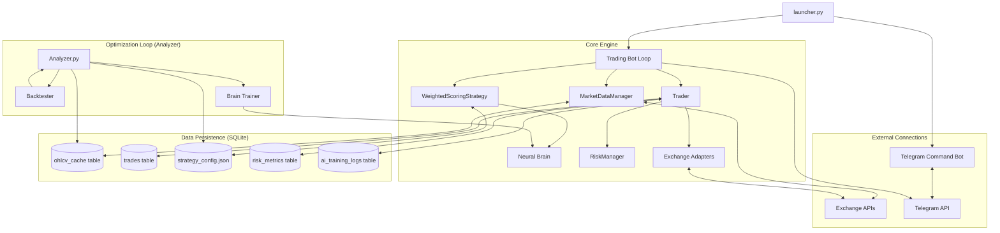

# Trading Bot Knowledge Base & System Flows

This document serves as the authoritative technical reference for the Trading Bot's architecture, logic flows, and operational procedures.

## 🏗 System Architecture

The bot is designed with a modular architecture to support multiple exchanges, complex strategy signals, and robust risk management.

---

## 🏎 Core Logic Flows

### 1. Market Data & Signal Flow
The bot operates on a "Heartbeat" cycle. Each cycle follows this data-to-signal pipeline:

1.  **Ingestion**: `MarketDataManager` fetches latest candles (OHLCV) from all `ACTIVE_EXCHANGES`.
2.  **Validation**: Candles are checked for integrity (NaNs, missing bars).
3.  **Feature Engineering**: Raw candles are transformed into 17+ technical indicators (RSI, EMA, MACD, etc.).
4.  **Scoring**: `WeightedScoringStrategy` applies weights from `strategy_config.json` to calculate a heuristic score.
5.  **Validation**: `NeuralBrain` (RL-MLP) performs a Veto (score < 0.3) or Boost (score > 0.8) on the signal.
6.  **Sizing**: If `score >= threshold`, `RiskManager` determines position size based on balance and target leverage.

### 2. Order Execution & Protection Flow
When a signal is approved:

1.  **Preparation**: `Trader` checks for existing positions and reserves balance.
2.  **Placement**: A `Limit` or `Market` order is sent to the specific **Exchange Adapter**.
3.  **Monitoring**:
    *   **Market**: Immediate fill, then SL/TP orders are created.
    *   **Limit**: Background task monitors fill status via adapter.
    *   **Churn Prevention**: Pending orders have a mandatory `MIN_PENDING_SECS` guard (default 120s) before they can be cancelled to allow exchange latency and liquidity to work. Orders are only cancelled early if a **Strong Reversal** signal (confidence > 0.4) is detected.
4.  **TP/SL Management**: For fills, the bot creates "Reduce-Only" orders (or attaches them directly if using Bybit V5). The bot tracks these using `sl_id` and `tp_id` keys to ensure database synchronization.

---

## 🔌 Exchange Adapters (Abstraction Layer)

The bot uses a specialized **Adapter Pattern** to handle multiple exchanges through a unified interface (`BaseAdapter`).

*   **Standardization**: All adapters provide uniform methods for `fetch_positions`, `create_order`, and `place_stop_orders`.
*   **Binance Adapter**: Handles `algoOrders` for SL/TP and uses specific timestamp synchronization.
*   **Bybit Adapter**: Manages `category: linear` for all V5 API calls and handles separate standard vs. conditional trigger queues.
*   **Factory**: `ExchangeFactory` initializes adapters in either **Live** or **Public** modes based on `.env` keys.

---

## 🧪 Strategic Optimization (Analyzer Flow)

The **Optimization Cycle** is a multi-step workflow orchestrated by `src/analyzer.py`. It ensures the bot's "brain" is adapted to the latest market volatility.

### Phase 0: Data Harvesting (`scripts/download_data.py`)
*   **Goal**: Ensure a deep historical dataset for training.
*   **Action**: Fetches up to 1000-2000 candles per symbol/timeframe from `ACTIVE_EXCHANGES`.
*   **Incremental Fetch**: Only downloads new candles since the last CSV timestamp.
*   **Output**: Compressed CSV files in root `/data/` (e.g., `BINANCE_BTCUSDT_1h.csv`).

### Phase 1: Signal Analysis & Grid Search
*   **Layer 1 (Trend Validation)**: Signals are tested against the 200 EMA. Only signals with >52% win rate in the trend direction are kept.
*   **Layer 2 (Diversity Check)**: Signals are categorized (Momentum, Vol, etc.). The top 3 from each category are selected to prevent overfitting to a single indicator type.
*   **Layer 3 (Grid Search Optimization)**: The bot tests 270+ combinations of SL (1-3.5%), RR Ratios (1-3.0), and Score Thresholds (2.0-7.0).

### Phase 2: Walk-Forward Validation
*   **In-Sample (70%)**: Trains the weights and thresholds.
*   **Out-of-Sample (30%)**: Validates the found config on unseen data.
*   **Consistency Check**: If the Win Rate drop between Train/Test is >25%, the configuration is rejected as overfitted.

### Phase 3: Detailed Backtesting (`src/backtester.py`)
*   **Action**: A high-fidelity simulation including **Trading Commission** and **Slippage Friction** (0.1%).
*   **Metrics**: Calculates Sharpe Ratio, Sortino Ratio, and Max Drawdown.
*   **Result**: Top-tier configurations are marked as `ENABLED` in `strategy_config.json`.

### Phase 4: Brain Training (`src/train_brain.py`)
*   **Goal**: Update the Reinforcement Learning (RL) Veto/Boost model.
*   **Action**: Reads `signal_performance.json`, extract 17 normalized features (snapshots), and trains a lightweight MLP.
*   **Outcome**: Deploys a new `brain_weights.json` used for real-time signal filtration.

---

## 📢 Communication & Notifications

The bot uses a dual-layered notification system for real-time monitoring and remote control.

### 1. Unified Notification (`notification.py`)
Provides consistent event reporting across Terminal and Telegram.
*   **Asynchronous Delivery**: Uses `aiohttp` for non-blocking Telegram API calls.
*   **Rate Limiting**: Throttles messages (max 1 per 0.5s) to stay within Telegram's 429 limits.
*   **Event Formatting**: Specialized templates for ⚪ **Pending**, ⚪ **Filled**, 🟢/🔴 **Closed**, and ❌ **Cancelled**.

### 2. Telegram Command Bot (`telegram_bot.py`)
Allows remote interaction with the bot instance.
*   **Commands**:
    *   `/status`: Authoritative report reconciling local data with live exchange positions.
    *   `/help`: Lists monitoring commands.
*   **Periodic Reports**: Automatically sends a full portfolio summary every 2 hours.

---

## 🩸 Lessons Learned & Technical Debt Log

### 1. Race Condition — `positions.json` Overwrite
*   **Discovery**: Multiple bot instances or fast updates could lead to state corruption.
*   **Solution**: Shared `Trader` Singleton + `asyncio.Lock` per Symbol ensures atomic writes.

### 2. The "Optimistic Deletion" Trap
*   **Discovery**: Internal price checks often trigger faster than exchange settlement.
*   **Impact**: Deleting local state before exchange confirmation leads to "Orphaned Orders".
*   **Lesson**: **Never delete local state in LIVE mode until the exchange confirms closure.** The exchange is the only source of truth.

### 3. The "Invisible" Algo Order Queue (Binance)
*   **Discovery**: Binance REST API `fetch_order` often misses SL/TP (Algo) orders.
*   **Impact**: Bot assumes the order is dead and enters an inconsistent state.
*   **Lesson**: Implement a **Fallback Query Pattern**. Check `fapiPrivateGetOpenAlgoOrders` if standard fetch fails.

### 4. Bulk Cancellation Filtering (Bybit & Binance)
*   **Discovery**: Standard `cancel_all_orders` often ignores conditional/algo orders.
*   **Impact**: Closing a position leaves live "Naked" SL/TP orders on the exchange.
*   **Lesson**: Use **Multi-Queue Sweeping**. Binance: `fapiPrivateDeleteAlgoOpenOrders`. Bybit: Double call with `orderFilter='Order'` and `'StopOrder'`.

### 5. Exchange Indexing Lag
*   **Lesson**: Implement a 500ms **Graceful Sync Sleep** before querying history after a closure to ensure accurate PnL capture.

### 6. Telegram "Authoritative Fetch"
*   **Discovery**: Defaulting to local cache (`positions.json`) for Telegram `/status` led to stale/wrong information.
*   **Lesson**: Manual user commands (buttons/slash commands) must **force a live exchange query** (`force_live=True`).

### 7. Global Exchange Sync
*   **Discovery**: The `/sync` command only reconciled the primary exchange, missing orphaned positions on secondary accounts.
*   **Lesson**: Implement **Parallel Multi-Exchange Reconciliation**. Loop through all active `traders` to ensure total synchronization across the entire portfolio.

### 8. The "Phantom Win" False Positive
*   **Discovery**: If a position disappears from the exchange (unplanned closure), the bot previously logged it as a 'WIN' based on the last known market price.
*   **Lesson**: **Explicit Verification is Mandatory.** When a position vanishes, the bot now must verify against the actual trade history (`fetch_my_trades`) up to 3 times. If no trade is found, it enters a `waiting_sync` state and **never** logs a phantom win.

### 9. Exchange-Native SL/TP Safety & Post-Verification Cooldown
*   **Discovery**: Relying on internal price checks to instantly trigger Stop-Loss cooldowns (e.g. inside the main loop) is unsafe during flash crashes or severe API lag, because the exchange's Stop order might fail or be delayed.
*   **Solution**: **Delegation to Exchange & Post-Verification.** The bot delegates SL/TP execution entirely to the exchange's matching engine. It *only* activates an SL Cooldown after the background `reconcile_positions` task verifies the position has actually vanished from the exchange due to a loss or an exit near the SL threshold.
### 10. Dry-Run Leak & Data Pollution
*   **Discovery**: Simulation mode (Dry-Run) was leaking API calls for SL/TP setup and verification, and mixing test data with live results.
*   **Lesson**: **Explicit Gating & File Separation.** Every method that interacts with the exchange must be audited for `dry_run` gating. Use `_test.json` suffixes for all state-tracking files (`positions`, `signal_performance`, `daily_config`) to ensure physical data isolation.

### 11. Bybit V5 "Side invalid" (10001) in One-Way Mode
*   **Discovery**: Standard `positionIdx: 0` for One-Way mode can still fail on Bybit V5 for some accounts or order types.
*   **Lesson**: **Progressive Retry Pattern.** If `positionIdx: 0` fails with "Side invalid", force-fetch the mode and then retry. If it still fails and the account is confirmed `MergedSingle`, retry by **omitting** `positionIdx` entirely.

### 12. Database Migration Priority
*   **Discovery**: Adding indexes or columns to the schema must happen *after* ensuring the database connection is initialized but *before* the application logic attempts to query those new structures.
*   **Lesson**: Run `PRAGMA incremental_vacuum` and schema migrations as the very first step in `initialize()`.

### 13. Order ID Persistence
*   **Discovery**: In `_monitor_limit_order_fill`, the `order_id` must be preserved in the `position` dictionary before it is moved to `active_positions`.
*   **Lesson**: If the `order_id` is lost during transition, the bot loses the ability to reconcile that specific trade with exchange history accurately.

### 14. TP-SL Key Mismatch (The `sl_order_id` vs `sl_id` trap)
*   **Discovery**: Logic in `execution.py` used `sl_order_id` while the database updater looked for `sl_id`.
*   **Lesson**: **Standardize Keys Early.** All position-related dicts must use the shortest consistent keys (`sl_id`, `tp_id`) to match the DB mapper's expectations.

---

## 🏷️ Naming & Isolation Standards

To ensure strict separation between Live and Dry-Run environments, the following naming conventions are enforced across the codebase:

### 1. Data File Isolation
State-tracking files in `src/` use a suffix-based isolation strategy:
- **Live Mode**: `filename.json` (e.g., `positions.json`)
- **Dry-Run Mode**: `filename_test.json` (e.g., `positions_test.json`)
- **Applies to**: `positions`, `trade_history`, `cooldowns`, `signal_performance`, `daily_config`.

### 2. Client Order ID (ClOrdID) Prefixes
Every order placed on an exchange is tagged with a unique Client ID for recovery and mode identification:
- **Live Prefix**: `bot_` (e.g., `bot_BTCUSDT_BUY_123456789`)
- **Dry-Run Prefix**: `dry_` (e.g., `dry_BTCUSDT_BUY_123456789`)
- **Structure**: `{prefix}{symbol}_{side}_{timestamp_ms}`

### 3. Symbol & Database Isolation
Wait-and-Patience and metadata tracking use a standardized symbol format to avoid discrepancy between Spot and Swap naming:
- **Internal Key**: `EXCHANGE_BASE_QUOTE_TIMEFRAME` (e.g., `BINANCE_BTC_USDT_1h`)
- **Exchange API Symbol**: Always normalized via `_normalize_symbol()` to remove extra suffixes (like `:USDT` on Bybit) before logging or state storage.
- **Database Root**: **No `.db` files allowed in root.** All SQLite databases (`trading_live.db`, `trading_test_v2.db`) must reside in the `/data/` directory.

---

## 🏛 Strategic Architectural Decisions

### 1. "Fast Deep Sync" Pattern
*   **Decision**: Move `reconcile_positions()` to the very beginning of the main bot loop.
*   **Rationale**: Prevents "Action on Stale Data". Synchronizing exchange reality *before* making trade decisions reduces race conditions.

### 2. Data Freshness Transparency
*   **Decision**: Label notifications with `[SYNCED]` or `[CACHED]`.
*   **Rationale**: Reduces "reporting dissonance" and improves user confidence by being explicit about the data source.
### 3. Authoritative Telegram Status
*   **Decision**: Expanded detection logic to check `contracts`, `amount`, and `info.size`.
*   **Rationale**: Bybit and Binance use different JSON keys for the "live" position size. Abstracting this in the status aggregator ensures no position is left behind just because of a naming convention.
---

## ⚙️ Operational Commands
1. **Launch Bot**: `python launcher.py`
2. **Global Optimization**: `python src/analyzer.py` (Full workflow: Harvest -> Analyze -> Validate)
3. **Train Brain**: `python src/train_brain.py` (Focus only on RL model update)

## 📁 Key Data Files

| File | Content | Dry-Run Counterpart |
|------|---------|---------------------|
| `src/positions.json` | Active/Pending positions | `positions_test.json` |
| `src/trade_history.json` | Completed trades log | `trade_history_test.json` |
| `src/signal_performance.json` | NN training snapshots | `signal_performance_test.json` |
| `src/daily_config.json` | Starting balance/Daily PnL | `daily_config_test.json` |
| `src/cooldowns.json` | Dynamic trade restrictions | `cooldowns_test.json` |
| `src/strategy_config.json` | Indicator weights (Shared) | N/A |
| `src/notification.py` | Alert delivery logic | N/A |

### 6. Bybit V5 & Recovery Stability
- **"Side invalid" (retCode 10001)**: In One-Way mode, omit `positionIdx` entirely. Sending `0` can fail on some account types.
- **Param Cleanup**: Cross-exchange logic (like recovery) must not leak exchange-specific parameters (e.g., `origClientOrderId` from Binance) into other adapters.
- **Fail-Fast Recovery**: Recovery blocks must only handle Network/Timeout errors. Logic errors (403, 10001, Insufficient Balance) must skip recovery to prevent infinite fail-loops.
- **Symbol Consistency**: ALWAYS use normalized symbols (`BTCUSDT`) for `client_id` to ensure tracking accuracy.
